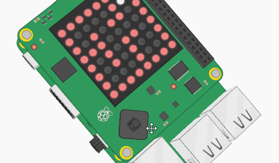

## Make the walls solid

You have probably noticed that when the marble moves around the maze, it deletes the walls as it goes. To prevent this from happening, you're going to need some basic **collision detection**. Write a new function for this.

+ Above your while loop, add this line of code to begin a new function:

```python
def check_wall(x,y,new_x,new_y):
```

+ Add code inside the `check_wall` function to check whether the `new_x` or `new_y` coordinate will be inside a wall. If either of the coordinates is inside a wall, return the old `x` or `y` value for that coordinate.

--- hints ---

--- hint ---
Here is the pseudo code:

`If` the location at `new_y, new_x` is not red (i.e. not a wall)
    `return` `new_x`, `new_y`
`elif` the location at `new_y, x` is not red (i.e. we can move up/down)
    `return` `x`, `new_y`
`elif` the location at `y, new_x` is not red (i.e. we can move left/right)
    `return` `new_x`, `y`
`else`
    `return` `x`, `y` (i.e. there is nowhere to move to so stay where you are)

--- /hint ---

--- hint ---
Here is how your code should look:

```python
def check_wall(x,y,new_x,new_y):
    if maze[new_y][new_x] != r:
        return new_x, new_y
    elif maze[new_y][x] != r:
        return x, new_y
    elif maze[y][new_x] != r:
        return new_x, y
    else:
        return x,y
```
--- /hint ---

--- /hints ---

+ Call the `check_wall` function within the `move_marble` function to decide what the `x` and `y` coordinates of the marble will be. Put this line of code immediately above the `return` line.

```python
new_x, new_y = check_wall(x,y,new_x,new_y)
```

+ Save and run your code. Move the Sense HAT and check that the marble now stops when it hits a wall in any direction.


