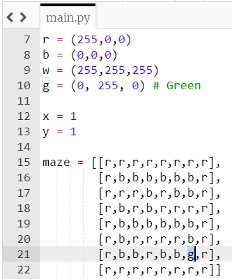
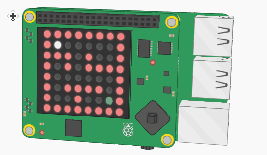

## Goal!

Lastly, you'll want a way for the player to win. You can pick any blank LED in the maze and set it as the target for the player to reach.

+ Create a new variable to store your chosen colour for the winning marker. Put this code with the other colour variables you already created.

+ Add the winning marker to the `maze` by changing one of the *b*'s in the grid to the letter representing your winning marker colour.

--- hints ---
--- hint ---
When you created the colour white for the marble, you used this line of code.
```python
w = (255,255,255)
```

Find this line of code and add a similar one underneath it for a colour of your choice. Be careful not to use a variable name that is already used - you can't use `b` (which is already used for blank) or `y` (which is already used for the y coordinate of the marble).
--- /hint ---

--- hint ---
Choose one of the letter `b` in the maze grid and change it to the letter you chose to represent your winning marker colour.

```python
maze = [[r,r,r,r,r,r,r,r],
        [r,b,b,b,b,b,b,r],
        [r,r,r,b,r,b,b,r],
        [r,b,r,b,r,r,r,r],
        [r,b,b,b,b,b,b,r],
        [r,b,r,r,r,r,b,r],
        [r,b,b,r,b,b,g,r],
        [r,r,r,r,r,r,r,r]]
```
--- /hint ---

--- hint ---
Here is how your code should look. I chose green for my winning marker colour:


--- /hint ---

--- /hints ---

+ Inside your `while` loop, once you have calculated the new `x`, `y` coordinates with the `move_marble` function, write an `if` statement to check whether the colour at this position is the winning colour.


+ If the colour is the winning colour, display a message saying "Win!" and set the `game_over` variable to `True` to end the game.

[[[rpi-sensehat-show-message]]]

--- hints ---
--- hint ---
Here is some pseudo code to help you:

**IF** maze (y, x) **EQUALS** the winning colour variable
**DISPLAY** "Win!" on the screen
**SET** `game_over` variable to `True`

Don't forget that the existing code (from line 56 onwards in the screenshot above) should **not** be indented, because it regardless of whether you reached the winning marker or not.
--- /hint ---

--- hint ---
Here is how your code should look:

--- /hint ---

--- /hints ---

- Save and run your code. Move the Sense HAT around and check that when you reach the winning marker your "Win!" message is displayed.


