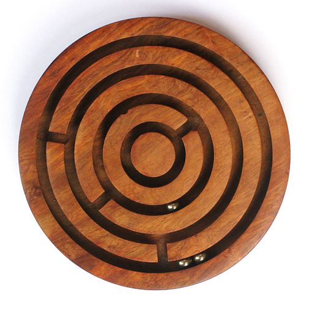

## What is a marble maze?

A marble maze is a game of skill and dexterity: one or more marbles are placed inside a maze, and the player guides them to a specific point by tilting the maze in various directions, causing the marbles to roll around.

_By Annielogue (Own work) [CC BY-SA 3.0 (http://creativecommons.org/licenses/by-sa/3.0)], via Wikimedia Commons_

Given that the Sense HAT is capable of reporting its exact orientation and has an in-built 8x8 pixel LED display, it is the perfect device with which to create an electronic marble maze game.
