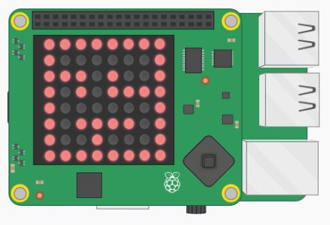

## Draw the maze

+ First, design a maze that fits on the 8×8 LED matrix on squared paper. It is important that the maze is constructed from solid walls, and that there are no diagonal gaps.

	

- Once you have drawn your maze, write down the initial of the colour used in each square.

	

Now you can recreate your maze on the Sense HAT's LED display.

+ Define the colour of the walls and the floor by specifying their RGB values. Add this code:

```python
r = (255,0,0)
b = (0,0,0)
```
In this example, `r` represents red and `b` represents blank.

[[[generic-theory-colours]]]

- Add code to draw your maze by copying the letters you wrote on your plan into a two-dimensional list. Each row of LEDs is represented by a list, and the lists for the eight rows are grouped together in a larger list.

	```python
	maze = [[r,r,r,r,r,r,r,r],
			[r,b,b,b,b,b,b,r],
			[r,r,r,b,r,b,b,r],
			[r,b,r,b,r,r,r,r],
			[r,b,b,b,b,b,b,r],
			[r,b,r,r,r,r,b,r],
			[r,b,b,r,b,b,b,r],
			[r,r,r,r,r,r,r,r]]

	```

**Note:** it is possible to draw on the LED matrix using a single list of 64 items. We have deliberately set up the maze as a two-dimensional list, because we will need to access the rows and columns of the LED matrix separately for the game. This will be much easier in a two-dimensional list.

- Display your maze on the LED matrix. To do this, **flatten** the two-dimensional list into a single one-dimensional list and then display it, like this:

```python
sense.set_pixels(sum(maze,[]))
```

- Save and run your code to see the maze displayed on the LED matrix.


