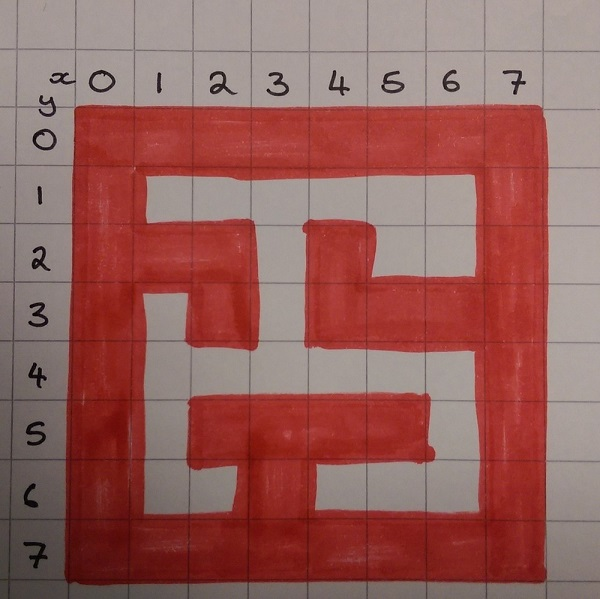
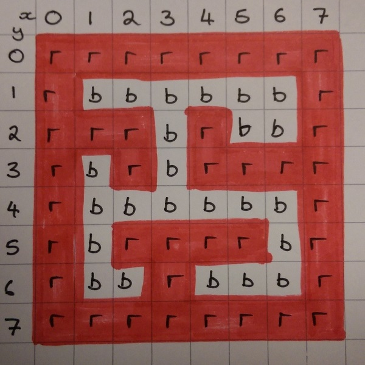

## Draw the maze

+ Design your maze on squared paper first, so that it fits on the 8x8 LED matrix. It is important that the maze is constructed from solid walls, and that there are no diagonal gaps.

	

- Once you have drawn your maze, write down the initial of the colour used in each square.

	

Now you can recreate your maze on the Sense HAT's LED display.

+ First, define the colour of the walls and the floor by specifying the RGB values. Add this code:

[[[rpi-sensehat-display-colour]]]

	```python
	r = (255,0,0)
	b = (0,0,0)
	```
In this example, `r` represents red and `b` represents blank.

- Add code to draw your maze by copying the letters you wrote on your plan into a two dimensional list. Each row of LEDs is represented by a single list, and the rows are grouped together in a larger list.

	```python
	maze = [[r,r,r,r,r,r,r,r],
			[r,b,b,b,b,b,b,r],
			[r,r,r,b,r,b,b,r],
			[r,b,r,b,r,r,r,r],
			[r,b,b,b,b,b,b,r],
			[r,b,r,r,r,r,b,r],
			[r,b,b,r,b,b,b,r],
			[r,r,r,r,r,r,r,r]]

	```

**Important:** It is possible to draw on the LED matrix using a single list of 64 items. We have deliberately set up the display as a two dimensional list because we will need to access the rows and columns of the LED matrix separately for the game.

- Display your maze on the LED matrix.

To do this you're going to need to **flatten** the **list of lists** into a single list, like this:

```python
sense.set_pixels(sum(maze,[]))
```

- Save and run your code to see the maze displayed on the LED matrix.

<iframe src="https://trinket.io/embed/python/3312ca9b94" width="100%" height="600" frameborder="0" marginwidth="0" marginheight="0" allowfullscreen></iframe>
