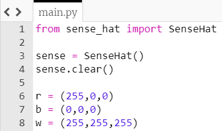
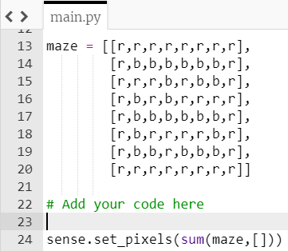
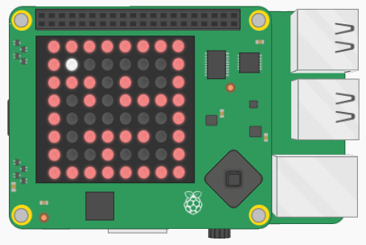

## Add a marble

The maze needs a marble. Let's change one of the LEDs in the maze list to white, to represent the marble.

+ Create a variable to store the colour white. Add this code underneath the code where you defined the other colours.

[[[rpi-sensehat-display-colour]]]

--- hints ---
--- hint ---
You defined the colour red like this. Can you add a line of code similar to this to represent the colour white?

```python
r = (255,0,0)
```
--- /hint ---

--- hint ---
Here is how your code should look:


--- /hint ---
--- /hints ---

+ Underneath the code for the colours, create two variables called `x` and `y` to represent the starting position of the marble. The variables `x` and `y` should both start with a value of 1.

[[[generic-python-creating-a-variable]]]

+ Add some code to set the pixel in the maze at the coordinates `y`, `x` to the colour white you just created.

```python
maze[y][x] = w
```



- Save your code and run it to see the maze and marble on the LED matrix.


