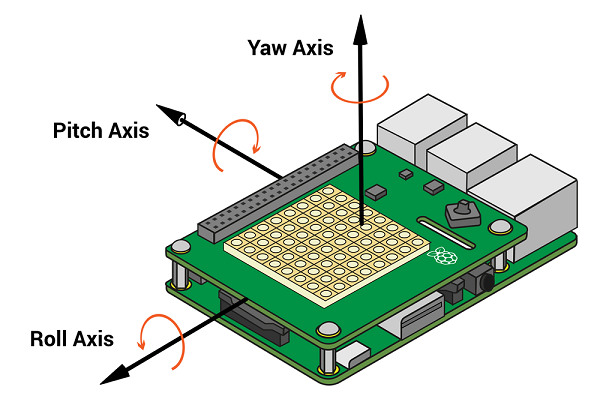
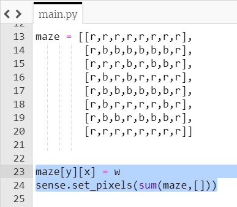
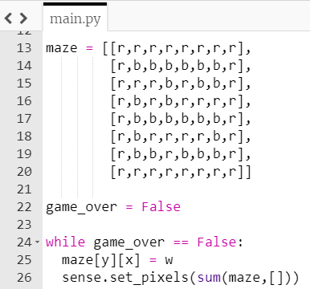
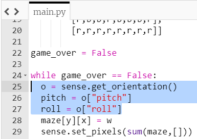

## Detect the pitch and roll

The marble's movement will be controlled by moving the Sense HAT. The Sense HAT library can detect pitch, roll and yaw. You can see a picture illustrating this below.

+ Locate the code that sets the position of the marble and draws the maze on the display.

+ Above this code, create a Boolean variable called `game_over` with a starting value of `False`.

+ Create a **while loop** which runs while the `game_over` variable is False. Put the two highlighted lines of code inside the loop.

[[[generic-python-while-boolean]]]

--- hints ---
--- hint ---
Here is the pseudo code:

**While** the `game_over` variable **equals** False:
Set the position of the marble in the maze
Draw the maze on the Sense HAT LED matrix

--- /hint ---

--- hint ---
You can put lines of code inside a loop by **indenting** them. Highlight the lines of code you wish to indent and press the tab key once.
--- /hint ---

--- hint ---
Here is how your code should look:

--- /hint ---

--- /hints ---

This will create a game loop allowing us to update the position of the marble when the Sense HAT is moved.

+ Add some code inside the `while` loop to detect the current **pitch** and **roll** of the Sense HAT.

[[[rpi-sensehat-pitch-roll-yaw]]]

--- hints ---
--- hint ---
First, detect the orientation of the Sense HAT using the `get_orientation` method and save this in a variable. Then extract the "pitch" and "roll" values.
--- /hint ---

--- hint ---
Here is how your code might look:

--- /hint ---
--- /hints ---

If you run your program at this stage, nothing different will happen as we need to put the pitch and roll data to work in the next step!
