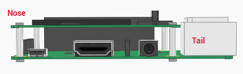

## Move the marble

+ **Above** the `while` loop, define a new function which will be used to move the marble.

```python
def move_marble(pitch, roll, x, y):
```

The function is passed the data `pitch`, `roll`, `x`, and `y` as parameters.

[[[generic-python-simple-functions]]]

+ Inside the function, make a copy of the `x` and `y` values:

```python
def move_marble(pitch, roll, x, y):
	new_x = x
	new_y = y
```

These will represent the new position of the marble after you've calculated whether it has moved based on the pitch and roll movements.

### How does the pitch value change?

Imagine the Raspberry Pi with the Sense HAT attached is an aeroplane and the end with the USB ports is the tail of the plane.

When the Sense HAT is lying flat, the **pitch** should be approximately 0.



If the Sense HAT is rotated so that the nose of the 'plane' is pointing into the air (as it would on take off), the pitch value will decrease (359,359,357,356...).


If the pitch is between 359 and 181, then `new_x` needs to increase to represent the marble moving towards the edge which is lowest to the ground, as marked on the diagram with a yellow arrow.

If the Sense HAT is rotated so that the nose of the 'plane' is pointing towards the ground (as it would on landing), the pitch value will increase (0,1,2,3,4...).


If the pitch is between 1 and 179, then `new_x` needs to decrease to represent the marble moving the opposite way.

### Coding the marble

If the pitch is between 1 and 179, then `new_x` should decrease by 1. Add some code within your `move_marble` function to reflect this:

```python
def move_marble(pitch,roll,x,y):
	new_x = x
	new_y = y
	if 1 < pitch < 179:
		new_x -= 1
	return new_x, new_y
```

+ Add some more code within your `move_marble` function to say "If the pitch is between 359 and 181, then `new_x` should increase by 1".

+ To test this code out, you'll need to call the function within the `while` loop.

```python
while not game_over:
	pitch = sense.get_orientation()['pitch']
	roll = sense.get_orientation()['roll']
	x,y = move_marble(pitch,roll,x,y)
	maze[y][x] = w
	sense.set_pixels(sum(maze,[]))
```

- Save and run your code. What happens?

<iframe src="https://trinket.io/embed/python/7197ab0e48" width="100%" height="600" frameborder="0" marginwidth="0" marginheight="0" allowfullscreen></iframe>


- There are two issues:
  - A single line of LEDs illuminate instead of a moving marble.
  - The code breaks with a `IndexError: list assignment index out of range` error.

- The first problem occurs because, once the marble moves onto the next LED, you have not changed the colour of the first LED back to black. This can be fixed by adding a short `sleep()` interval and then setting the colour of the `x`,`y` LED in the while loop. Import the `time` library first, near where you imported the SenseHat library.

	```python
	from time import sleep
	```

- Then alter the `while` loop, so that the white LED is reset to black in each cycle.

	```python
	while not game_over:
		pitch = sense.get_orientation()['pitch']
		roll = sense.get_orientation()['roll']
		x,y = move_marble(pitch,roll,x,y)
		maze[y][x] = w
		sense.set_pixels(sum(maze,[]))
		sleep(0.05)
		maze[y][x] = b
	```

- Save and run your code to check that the marble looks as if it is moving.

- The `IndexError: list assignment index out of range` error needs to be fixed next. This occurs because both `x` and `y` values can increase above `7` or decrease below `0`. As this would be outside the boundaries of the LED matrix, the SenseHat library returns an error. This can be fixed by only changing `x` and `y` when they are **not** equal to 0 or 7. Alter your `move_marble` function so that it looks like this:

	```python
	def move_marble(pitch,roll,x,y):
		new_x = x
		new_y = y
		if 1 < pitch < 179 and x != 0:
			new_x -= 1
		elif 359 > pitch > 179 and x != 7 :
			new_x += 1
		return new_x,new_y
	```

- Save and run your code to ensure the marble is moving horizontally across the screen.

- Now that you have the marble moving horizontally, you need to make it move vertically as well. Update the `move_marble` function so that it uses the `roll` to move the marble in the y direction.

	```python
	def move_marble(pitch,roll,x,y):
		new_x = x
		new_y = y
		if 1 < pitch < 179 and x != 0:
			new_x -= 1
		elif 359 > pitch > 179 and x != 7 :
			new_x += 1
		if 1 < roll < 179 and y != 7:
			new_y += 1
		elif 359 > roll > 179 and y != 0 :
			new_y -= 1
		return new_x,new_y
	```

- Your full code should now look like this:

	```python
	from sense_hat import SenseHat
	from time import sleep

	sense = SenseHat()
	sense.clear()

	r = (255,0,0)
	b = (0,0,0)
	w = (255,255,255)

	x = 1
	y = 1

	maze = [[r,r,r,r,r,r,r,r],
			[r,b,b,b,b,b,b,r],
			[r,r,r,b,r,b,b,r],
			[r,b,r,b,r,r,r,r],
			[r,b,b,b,b,b,b,r],
			[r,b,r,r,r,r,b,r],
			[r,b,b,r,b,b,b,r],
			[r,r,r,r,r,r,r,r]]

	def move_marble(pitch,roll,x,y):
		new_x = x
		new_y = y
		if 1 < pitch < 179 and x != 0:
			new_x -= 1
		elif 359 > pitch > 179 and x != 7 :
			new_x += 1
		if 1 < roll < 179 and y != 7:
			new_y += 1
		elif 359 > roll > 179 and y != 0 :
			new_y -= 1
		return new_x,new_y

	game_over = False

	while not game_over:
		pitch = sense.get_orientation()['pitch']
		roll = sense.get_orientation()['roll']
		x,y = move_marble(pitch,roll,x,y)
		maze[y][x] = w
		sense.set_pixels(sum(maze,[]))
		sleep(0.05)
		maze[y][x] = b

	```

<iframe src="https://trinket.io/embed/python/5c2e24ced3" width="100%" height="600" frameborder="0" marginwidth="0" marginheight="0" allowfullscreen></iframe>
