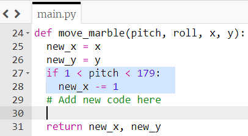

## Move the marble

+ **Above** the `while` loop, define a new function which will be used to move the marble.

```python
def move_marble(pitch, roll, x, y):
```

The function is passed the data `pitch`, `roll`, `x`, and `y` as parameters.

[[[generic-python-simple-functions]]]

+ Inside the function, make a copy of the `x` and `y` values:

```python
def move_marble(pitch, roll, x, y):
	new_x = x
	new_y = y
```

These will represent the new position of the marble after you've calculated whether it has moved based on the pitch and roll movements.

### How does the pitch value change?

Imagine the Raspberry Pi with the Sense HAT attached is an aeroplane and the end with the USB ports is the tail of the plane.

When the Sense HAT is lying flat, the **pitch** should be approximately 0.


If the Sense HAT is rotated so that the nose of the 'plane' is pointing into the air (as it would on take off), the pitch value will decrease (359,359,357,356...).


If the pitch is between 359 and 181, then `new_x` needs to increase to represent the marble moving towards the edge which is lowest to the ground, as marked on the diagram with a yellow arrow.

If the Sense HAT is rotated so that the nose of the 'plane' is pointing towards the ground (as it would on landing), the pitch value will increase (0,1,2,3,4...).


If the pitch is between 1 and 179, then `new_x` needs to decrease to represent the marble moving the opposite way.

### Coding the marble

If the pitch is between 1 and 179, then `new_x` should decrease by 1. Add some code within your `move_marble` function to reflect this:



+ Add more code at the location specified above to say "If the pitch is between 359 and 181, then `new_x` should increase by 1" which will move the marble to the right.

+ To test this code out, you'll need to **call the function**. Add this line of code inside the `while` loop.


- Save and run your code, then move the Sense HAT to change the pitch.

--- collapse ---
---
title: What happens on the screen?
---
The marble does not exactly behave as we would like it to!


--- /collapse ---
