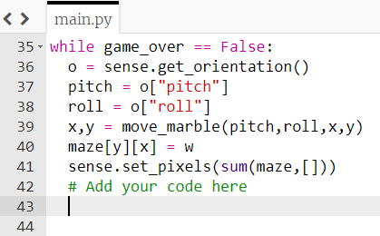
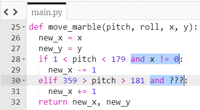
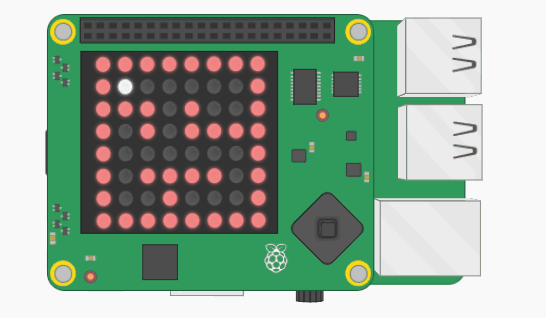
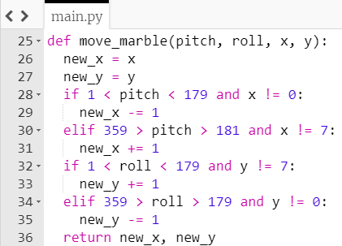
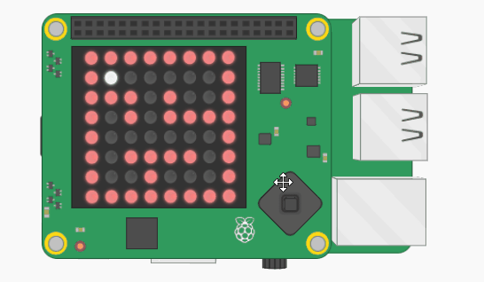

## Fix the marble

There are two problems:
  - The marble is a whole line of illuminated LEDs, instead of just one LED
  - The code breaks with a `IndexError: list assignment index out of range` message

### Problem 1 — lots of LEDs are illuminated

The first problem occurs because, once the marble moves onto the next LED, the colour of the first LED does not change back to blank.

+ Use the `sleep` function to add a pause of 0.05 seconds.



[[[generic-python-sleep]]]


+ Then, on the line below the `sleep`, add code to tell the LED at the current `x, y` position to reset itself to blank.

--- hints ---
--- hint ---
Here is the line of code you used to tell the LED at the current position to turn white:

```python
maze[y][x] = w
```

Can you alter this code to tell the LED to turn blank?
--- /hint ---

--- hint ---
Your code should look like this:

```python
while not game_over:
    pitch = sense.get_orientation()['pitch']
    roll = sense.get_orientation()['roll']
    x,y = move_marble(pitch,roll,x,y)
    maze[y][x] = w
    sense.set_pixels(sum(maze,[]))
    sleep(0.05)
    maze[y][x] = b
```
--- /hint ---
--- /hints ---

+ Save and run your code. Move the Sense HAT to check that the marble looks as if it is moving.

### Problem 2 — error message

This error occurs because, in the `move_marble` function, we always add or substract `1` from the value of the `new_x` variable, depending on which way the Sense HAT is tilted. Eventually this means that the value of `new_x` value will increase above `7` or decrease below `0`. As these values would be outside the boundaries of the LED matrix, we get an error.

This can be fixed by changing the code so that the values of `x` and `y` are only allowed to decrease or increase when they are **not** equal to 0 or 7.

+ Alter your `move_marble` function to check that adding or substracting`1` from the `new_x` value will not cause the marble to go off the edge. The first change looks like this:



+ Save and run your code. Tilt the Sense HAT to check that the marble doesn't get stuck.

--- collapse ---
---
title: What will the result look like?
---



--- /collapse ---

You might notice that your marble gobbles up the walls when it touches them — we'll fix that in the next step!

Now that you have the marble moving horizontally, you need to make it move vertically as well.

+ Add some more code to the `move_marble` function so that it uses the `roll` value to move the marble up and down in the `y` direction.

--- hints ---
--- hint ---
If you imagine your Sense HAT as a plane again, the roll axis would be the plane rotating from side to side, as if it was doing a victory roll.

Work out which range of values of `roll` mean the marble should move down the LED matrix, and which range of values of `roll` mean it should move up.
--- /hint ---

--- hint ---
Inside the function, duplicate the code you used for changing `new_x`. Check out the code below for how to do this, but change the values marked with question marks:

```python
if 1 < ??? < 179 and ? != ?:
    ???
elif 359 > ??? > 179 and ? != ? :
    ???
```

--- /hint ---

--- hint ---
Here is how your code should look:



--- /hint ---

---- /hints ---


--- collapse ---
---
title: What will the result look like?
---


--- /collapse ---
